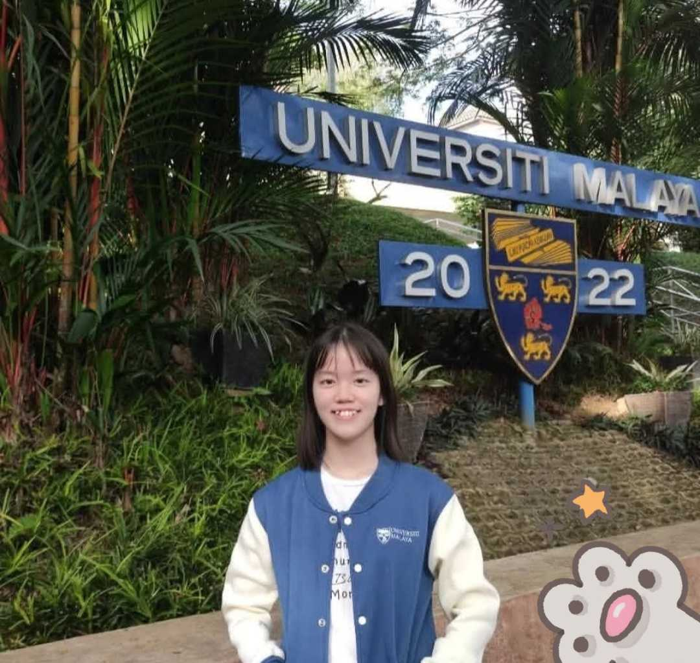

# Introduction
Hi! I'm Lee Hui Hui, a Software Engineering student in the Software Maintenance and Evolution course.
 
 
I expect to learn a lot about modern software maintenance practices and how to work with legacy system.
 
 
I’m also aiming to gain hands-on experience in refactoring, improving test coverage, collaborating through Git branches and pull requests, setting up basic CI, and writing clear, maintainable documentation.
 
 

## GitHub Profile

You can view my personalized GitHub profile https://github.com/leehuihuii

